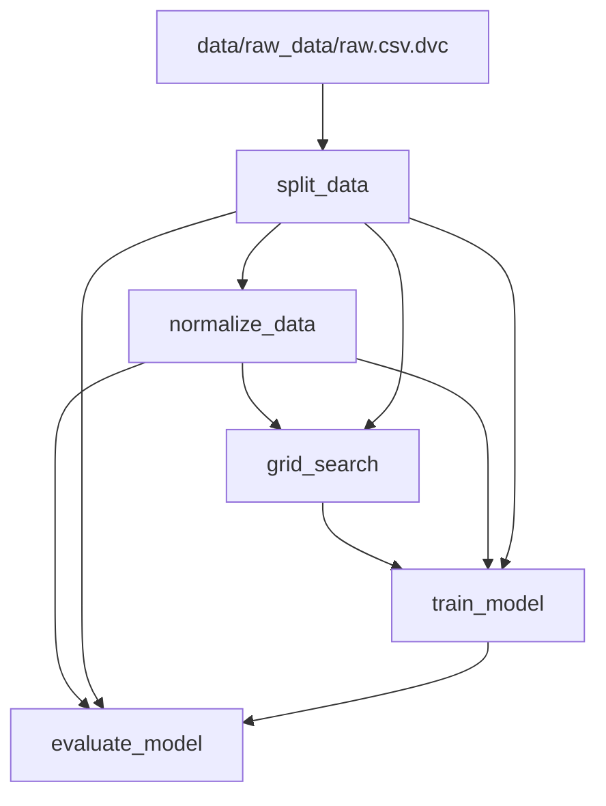

# Examen DVC et Dagshub

Dans ce dépôt vous trouverez l'architecture proposé pour mettre en place la solution de l'examen.

```bash
├── examen_dvc
│   ├── data
│   │   ├── processed
│   │   └── raw
│   ├── metrics
│   ├── models
│   │   ├── data
│   │   └── models
│   ├── src
│   └── README.md
```

N'hésitez pas à rajouter les dossiers ou les fichiers qui vous semblent pertinents.

Vous devez dans un premier temps *Fork* le repo et puis le cloner pour travailler dessus. Le rendu de cet examen sera le lien vers votre dépôt sur DagsHub. Faites attention à bien mettre https://dagshub.com/licence.pedago en tant que colaborateur avec des droits de lecture seulement pour que ce soit corrigé.

Vous pouvez télécharger les données à travers le lien suivant : https://datascientest-mlops.s3.eu-west-1.amazonaws.com/mlops_dvc_fr/raw.csv.


